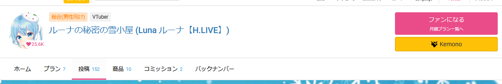
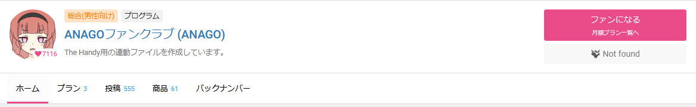

# KemonoButton

## What is this?
A simple script that will create a button on any webpage that will lead to a gallery on kemono.
It also check if the page exist on kemono, before adding it to the page.

## Why?
It's kinda annoying to copy the name or id from Fanbox / Fantia / Patreon into kemono, and found out it doesn't exist.

## Install
Use tampermonkey and install [the script](https://raw.githubusercontent.com/mbaharip/KemonoButton/main/src/kemono-button.user.js).

## Supported URLs
### Fanbox
- `[username].fanbox.cc`
- `www.fanbox.cc/@[username]`
### Fantia
- `fantia.jp/fanclubs/[fanclubId]`
- `fantia.jp/posts/[postId]`
- `fantia.jp/products/[productId]`
### Patreon
- `www.patreon.com/[username]`
- `www.patreon.com/user?u=[userId]`
### OF
- `{of}/[username]`

## Preview
### Fanbox

### Fantia

### Patreon

### OF

### Not found example
